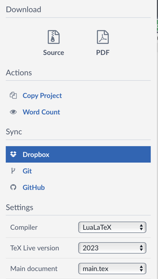

# Konya Food and Agriculture University Thesis/Report Template
This is the template for PhD and Master's Thesis given to Konya Food and Agriculture University to run under Overleaf.

In order to run this template, you need to set your LaTeX compiler as ```LuaLateX``` in Overleaf.



You need to fill in ``preamble.tex`` to enter the meta-data about your thesis.

Your main text will be ``main.tex``. Please use the figures, tables, equations and algoritms as examples.

The other files as follows:

``references.bib``: Your reference list in biblatex format.

``abbrev.tex``: List of Abbreviations

``cv.tex``: Your CV (required for PhD, not required for Master's Thesis). The format is explained in the sample CV.

``supplementary.tex``: Additional material, tables, figures, pictures, that don't fit anywhere in the main text.
